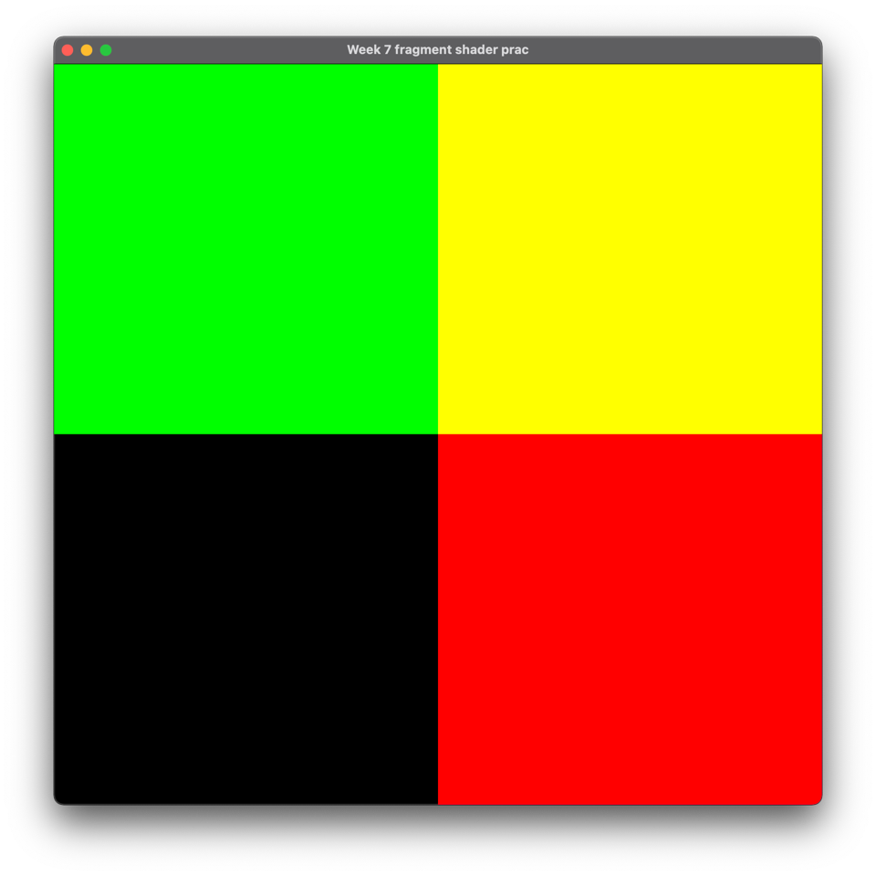
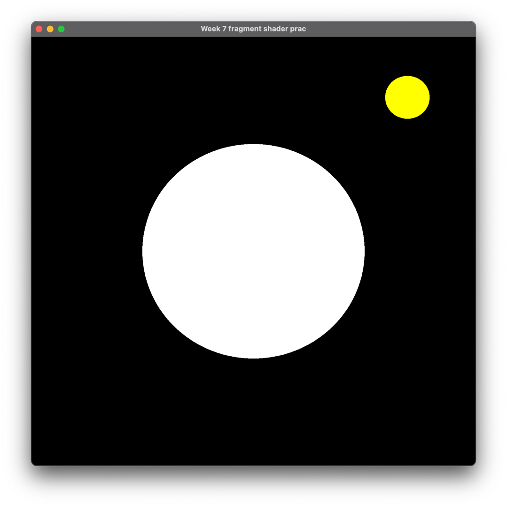
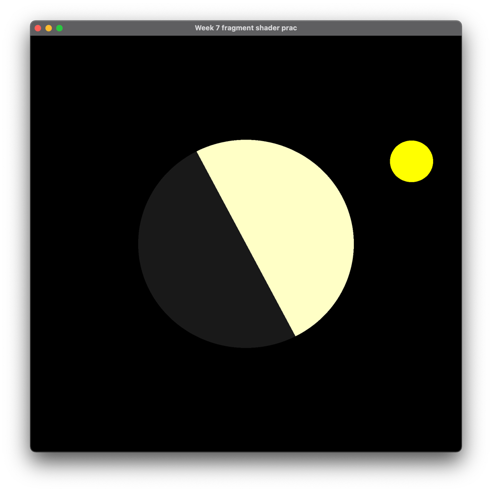
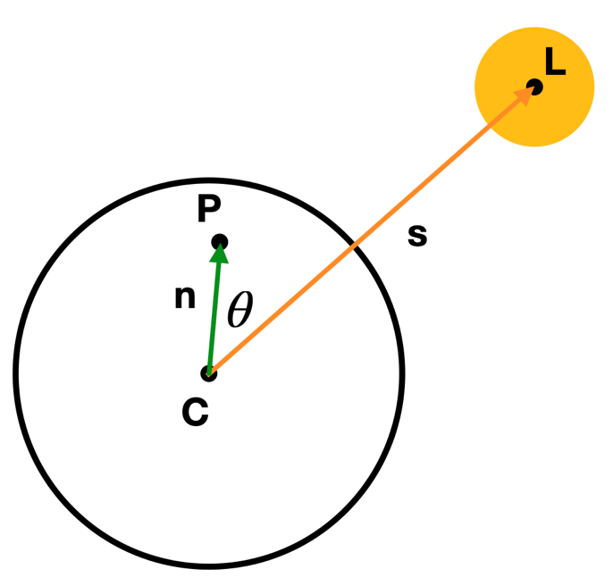
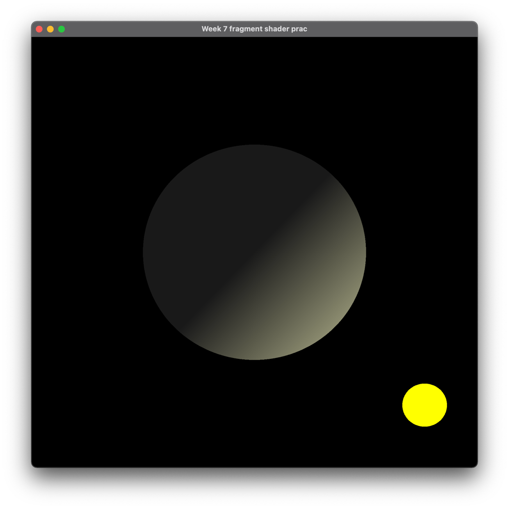
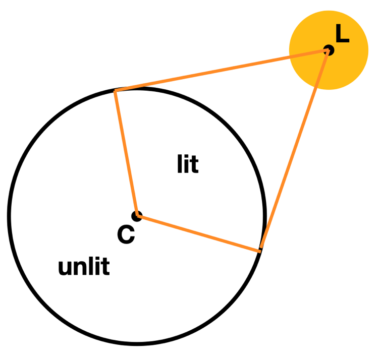
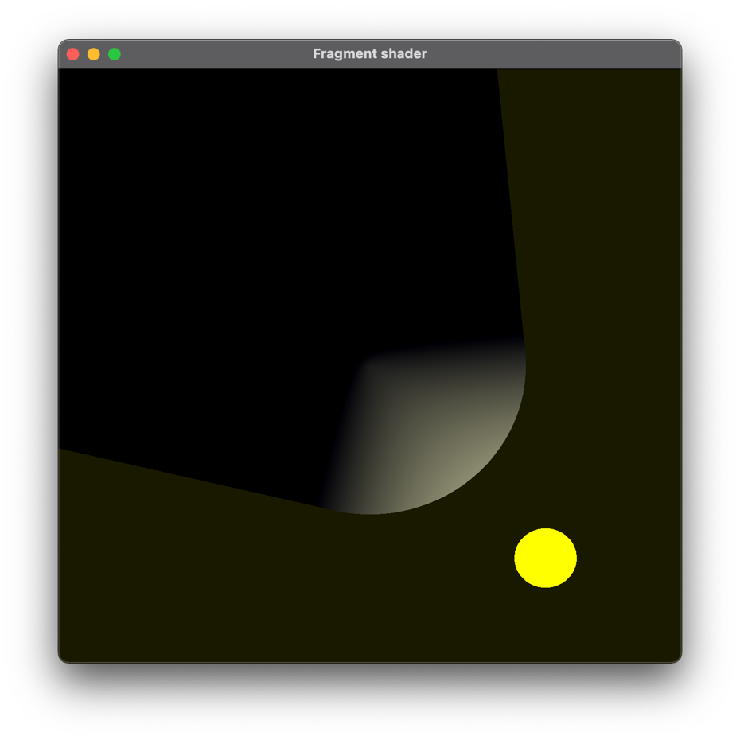
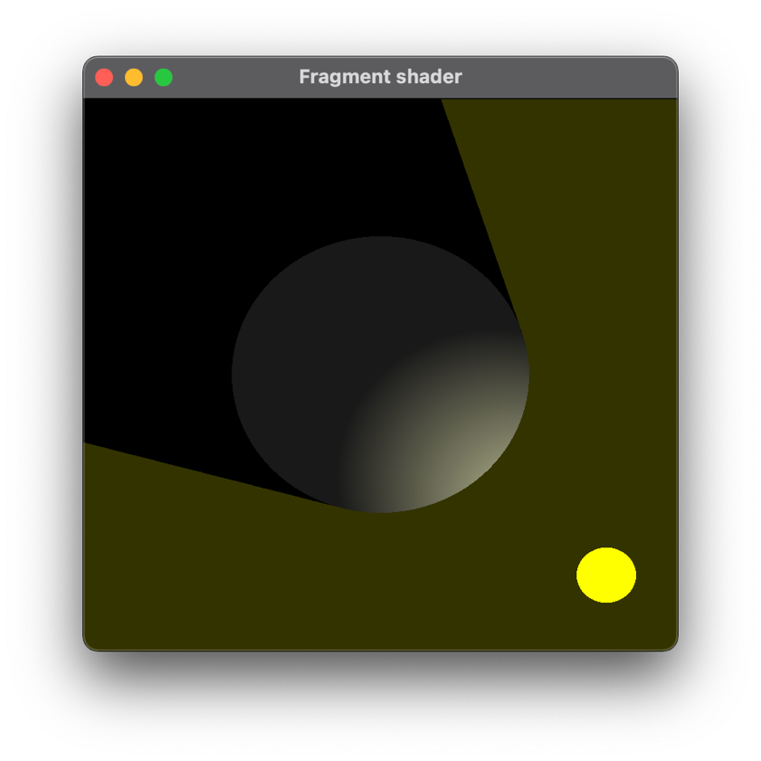
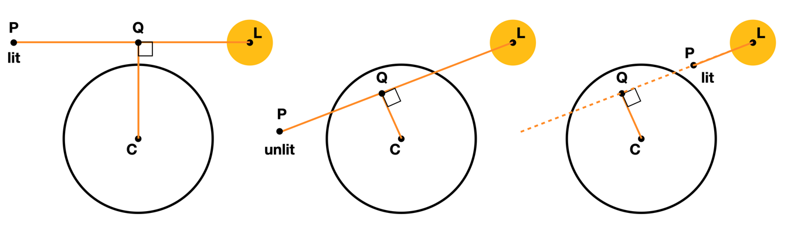

# COMP3170 Week 7 Prac: Lighting Concepts

In this task we will be experimenting with fragment shaders and introducing some ideas that will be important when we do lighting in week 9.

The template code implements a Quad mesh that draws a black rectangle in NDC coordinates that fills the entire window. No model or camera matrices are implemented. Instead, we will draw on this mesh using a fragment shader (as we did in week 1).

## Task 1
The current fragment shader includes a uniform 2D vector `u_viewportSize` that contains the size of the viewport in pixels. We can use this to calculate the NDC coordinates of a fragment based on its viewport coordinates given by `gl_FragCoord`.

Calculate the 2D NDC coordinates of the fragment. Colour the fragment red if the x coordinate is positive, green if the y coordinate is positive, and yellow if both are positive. 

Your output should look like this:


 
Check that your code works for any size and shape of the window.

Take a moment to think about why this is the case. Make sure you understand how you achieved this result before moving on. 

## Task 2
We’re going to draw a circle and simulate how it would respond to a moving light source.

Draw a white circle in the centre of the window by testing which fragments lie within a given radius of the origin, as we did in the week 1 prac.

The `update()` method in the Quad class reads the mouse position from the Input class. The value is given as a vector in NDC coordinates, but the solution isn't complete:

```
public void update(InputManager input, float deltaTime) {
	// get the mouse position in NDC as a vector (x, y, 0, 1)
	input.getCursorPos(mousePosition);
	mousePositionFloat.x = mousePosition.x/(viewportSize.x/2) - 1;
	mousePositionFloat.y = mousePosition.y/(viewportSize.y/2) - 1;
	// NOTE: This won't work, because getCursorPos() returns a y value that treats the top left corner of the screen as (0,0) - how do you fix this?
	}
```

`getCursorPos()` treats the top left of the screen as (0,0). Although the provided code gets this within the right range for NDC, the y value is around the wrong way - how might you fix this?

Create a uniform to pass this value into the shader. Draw a smaller yellow circle at the mouse location. We are going to treat this yellow circle as our "light".

Your output should look like this:


 
## Task 3
First, we want to shade the large circle so the whole side facing the light source is brightly lit, while the other side is only dimly visible:


 
Consider the diagram:



* The point C is the centre of the large circle.
* The point P is the fragment being drawn.
* The point L is the position of the light source.
* n is the vector from C to P
* s is the vector from C to L
 * θ is the angle between n and s

Copy this diagram into your sketchbook. Consider:

* For what values of θ is the point P lit/unlit?
* What is an easy way to calculate this just using n and s without doing any trig? (Hint: check the week 2 lectures!)

Implement this.

## Task 4
We now want to shade the circle, so the light falls off as the angle between n and s increases:



You can use the GLSL function `mix(x, y, t)` to linearly interpolate between two colours x and y by a proportion t. 

What factor should you use to blend the light and dark colours? (Hint: you’re already calculating it).

Check how your shading changes as you move the light source closer or further away from the centre circle. Does it vary? If so, what is causing this? How could you fix it?

## Task 5
Suppose instead we only want to light the parts of the circle that would be hit directly by the light:



Copy this diagram into your sketchbook.

Consider a point P in the large circle. How can you calculate whether it is in the lit or unlit area? This should be a simple change to your existing code and not involve any trig.

Implement this. Your result should look like this:



## Task 6 (Challenge)
Add a shadow effect by brightening the parts of space that can be ‘seen’ by the light source:



To decide whether a fragment at point P should be lit, we need to test whether the line segment LP intersects the big circle. We can do this by calculating the point Q on the line LP which lies nearest to the centre of the circle C.



There are three cases to consider (as shown above):
* The distance from Q to C is more than the radius of the circle, in which case the line doesn’t intersect the circle. So, point P should be lit.
* Otherwise:
** The intersection point Q lies between L and P, in which case the point P should be dark.
** Otherwise, P should be lit.

To calculate Q we rely on two facts:
	All points on the line joining L and P have the form:
 
	Q=L+(P-L)t

for some scalar value t. 

If Q is the closest point to C then the vector n=Q-C is perpendicular to the vector v=P-L. i.e.:

	n.v=0

Combining these two equations, you should be able to work out an equation to calculate Q. Using the three cases above, this should allow you to decide whether P should be lit or not.

## To receive a mark today, show your demonstrator:
* Your conversion of mouse positions to NDC.
* Your workbook sketches of how light should behave.
* Your working project up to and including Task 5.
